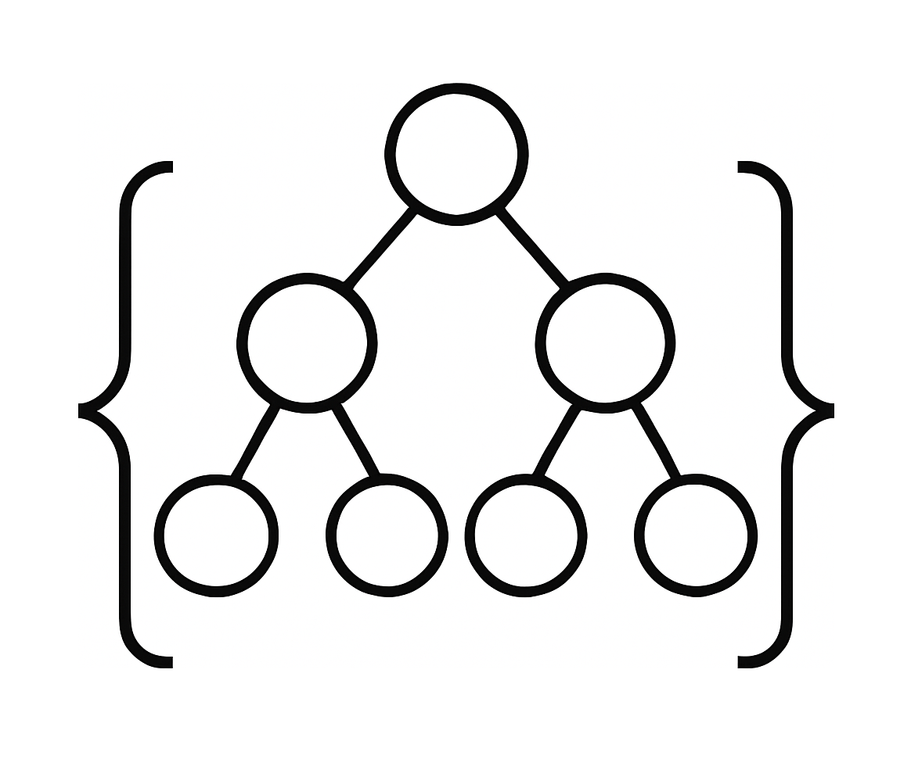

the-genealogy-ui
================

### The Genealogy Project application's frontend.

<p>
  
</p>

[](https://github.com/the-genealogy-project/the-genealogy-ui/actions/workflows/build.yaml)

Prerequisites
-------------

To avoid any unexpected application behavior, make sure you have installed the following tool with the proper version number:

- [Node 20.11.1](https://nodejs.org/en/blog/release/v20.11.1)

Run project locally
-----------------------

### Install project dependencies

```bash
npm install
```

### Starting application with Node Package Manager:

```bash
npm run dev
```

#### To view the application, open [http://localhost:3000](http://localhost:3000) in your web browser.
